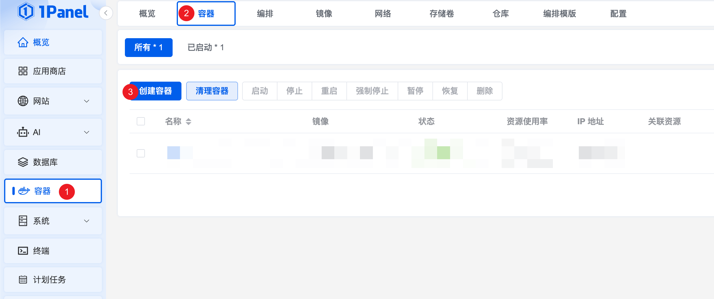
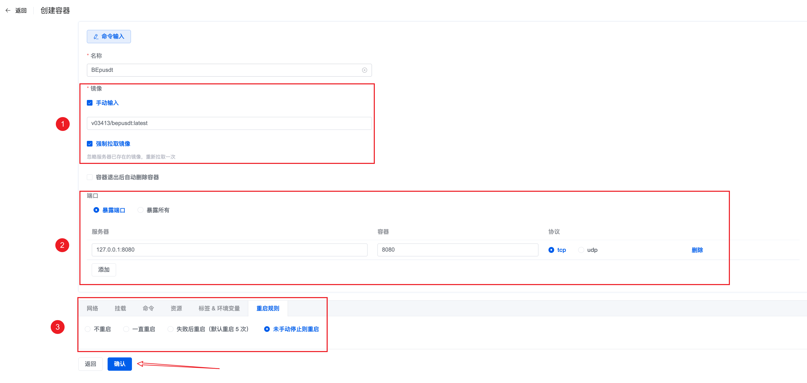
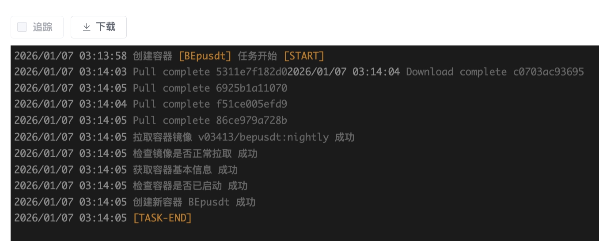
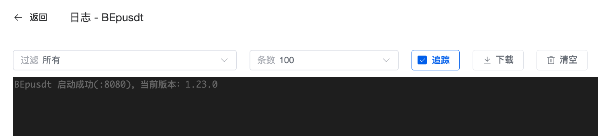

# 1Panel 部署 BEpusdt 教程

> 📋 **前置条件**：本教程假定您已成功安装并配置好 1Panel 面板。

## 快速部署指南

### 第一步：创建容器

在 1Panel 控制台中，找到并点击【**创建容器**】按钮。



---

### 第二步：配置容器参数



#### 关键配置说明

| 配置项      | 说明                                                                                      |
|----------|-----------------------------------------------------------------------------------------|
| **镜像选择** | • **正式版**：`v03413/bepusdt:latest`（推荐生产环境）<br>• **开发版**：`v03413/bepusdt:nightly`（体验最新特性） |
| **端口映射** | • **仅本机访问**：`127.0.0.1:8080:8080`（适合配合反向代理）<br>• **允许外网**：`8080:8080`（不推荐，建议使用反向代理）     |

> ⚠️ **安全提示**：为保证安全，强烈建议使用 `127.0.0.1` 绑定本地，再通过反向代理对外提供服务。

确认配置无误后，点击【**确认**】按钮启动容器。

---

### 第三步：验证启动状态

容器启动后，点击【**控制台**】查看日志输出。

当看到以下日志信息时，表示服务已成功启动：




✅ **启动成功标志**：日志中显示服务监听地址和端口信息

---

## 配置反向代理（推荐）

### 为什么需要反向代理？

- ✅ 提供 HTTPS 安全访问
- ✅ 隐藏真实端口，提升安全性
- ✅ 支持域名访问，更加专业

### 配置步骤

1. **进入网站管理**

   返回 1Panel 首页 → 左侧菜单【**网站**】→ 点击【**创建网站**】→ 选择【**反向代理**】

   > 📌 **前提**：确保已安装 OpenResty

2. **填写代理配置**

   

   #### 核心配置项

   | 配置项 | 填写内容 | 说明 |
   |--------|-------------------------|------|
   | **主域名** | `coin.example.com`      | 填写您的域名 |
   | **代理地址** | `http://127.0.0.1:8080` | 指向容器端口 |
   | **其他设置** | 按需配置 | 如启用缓存、设置请求头等 |

3. **完成域名解析**

   在域名服务商处添加 A 记录，将域名指向服务器 IP

4. **配置 HTTPS（强烈推荐）**

    - 在网站管理中申请 SSL 证书
    - 启用 HTTPS 强制跳转
    - 提升安全性和用户信任度

---

## 验证部署

配置完成后，通过浏览器访问您的域名，应该能正常访问 BEpusdt 服务。

### 访问测试

- **HTTP 访问**：`http://your-domain.com`
- **HTTPS 访问**：`https://your-domain.com`（推荐）
- **API 测试**：`https://your-domain.com/api/v1/health`

---

## 常见问题

**Q：无法访问服务怎么办？**

A：请依次检查：

1. 容器是否正常运行（查看日志）
2. 端口是否被防火墙拦截
3. 域名解析是否生效（`ping your-domain.com`）
4. 反向代理配置是否正确

**Q：是否必须配置反向代理？**

A：不是必须，但强烈推荐。直接暴露端口存在安全风险，且无法使用 HTTPS。

**Q：如何更新到最新版本？**

A：

```bash
# 拉取最新镜像
docker pull v03413/bepusdt:latest

# 重新创建容器（通过 1Panel 操作）
```

---
