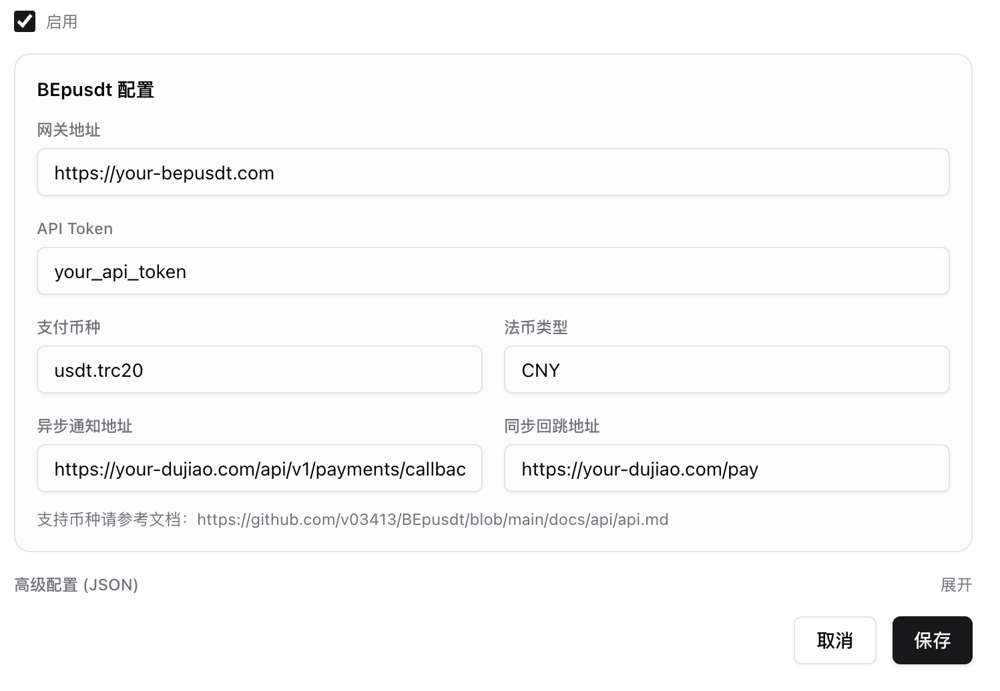

# DuJiao Next 对接 BEpusdt 集成指南

**当前教程针对的是新版独角 [Dujiao Next](https://dujiao-next.com/)，旧版独角数卡对接[请看这个](../dujiaoka/dujiaoka.md)**

## 前提条件

在开始配置前，请确保已满足以下条件：

**BEpusdt 部署信息**

- API 服务地址：`https://your-bepusdt.com`
- API 密钥：`your_api_token`

**DuJiao Next 部署信息**

- 部署地址：`https://your-dujiao.com`
- 已进入后台管理界面
- 已找到支付渠道管理 > 新增渠道功能

## 配置步骤

在 DuJiao Next 后台中选择渠道类型为 BEpusdt，按照以下格式进行配置。

**必填配置项**

| 配置项       | 说明                 | 示例                                                 |
|-----------|--------------------|----------------------------------------------------|
| 网关地址      | BEpusdt 的 API 服务地址 | `https://your-bepusdt.com`                         |
| API Token | BEpusdt 的 API 密钥   | `your_api_token`                                   |
| 支付币种      | 支持的加密资产类型，严格区分大小写  | `usdt.trc20`                                       |
| 法币类型      | 支持的法定货币类型          | `CNY`、`USD`、`EUR`、`JPY`、`GBP`                      |
| 异步通知地址    | 交易完成时的服务器异步回调地址    | `https://your-dujiao.com/api/v1/payments/callback` |
| 同步回跳地址    | 用户支付完成后的页面跳转地址     | `https://your-dujiao.com/pay`                      |

**配置说明**

- **支付币种**：详见 [支持的币种列表](https://github.com/v03413/BEpusdt/blob/main/docs/trade-type.md)，必须严格区分大小写。
- **法币类型**：仅支持 `CNY`、`USD`、`EUR`、`JPY`、`GBP` 五种，必须严格区分大小写。

**⚠️ 重要说明：异步通知地址和同步回跳地址**

这两个地址的路由部分 **严格按要求修改**，只需将域名部分替换为您实际部署的 DuJiao Next 服务器地址：

- **异步通知地址**：`https://your-dujiao.com/api/v1/payments/callback`
    - 路由固定为 `/api/v1/payments/callback`
    - 示例：若部署地址为 `https://example.com`，则填写 `https://example.com/api/v1/payments/callback`

- **同步回跳地址**：`https://your-dujiao.com/pay`
    - 路由固定为 `/pay`
    - 示例：若部署地址为 `https://example.com`，则填写 `https://example.com/pay`

## 配置验证

配置完成后，请按照以下步骤进行测试：

1. 进入 DuJiao Next 前台，进行支付测试。
2. 观察是否正常跳转到支付页面。

## 故障排查

若出现网关错误提示，请按照以下步骤排查：

- **检查网络连通性**：确认 DuJiao Next API 所在服务器能够正常访问 BEpusdt API 地址。
- **检查 API Token**：确认所配置的 API Token 与 BEpusdt 中的密钥一致。
- **查看日志**：检查 DuJiao Next 和 BEpusdt 的应用日志，获取更详细的错误信息。
