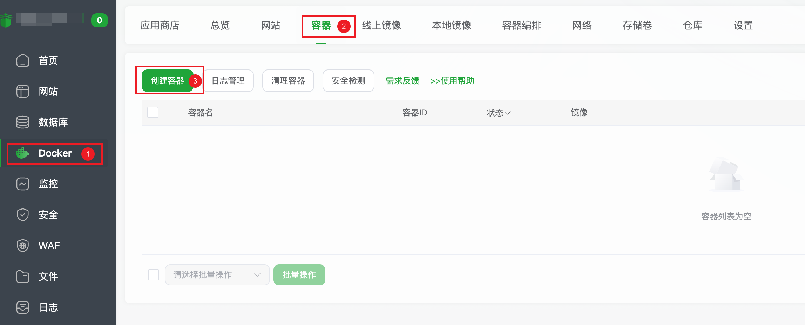
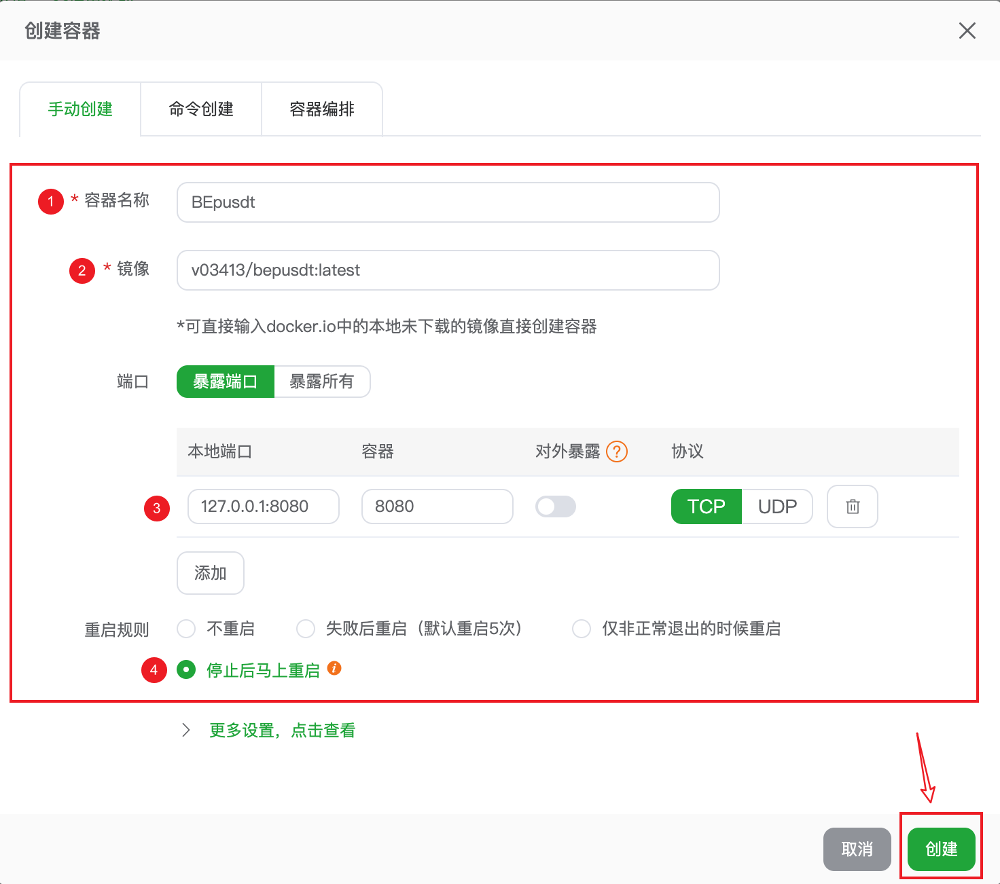
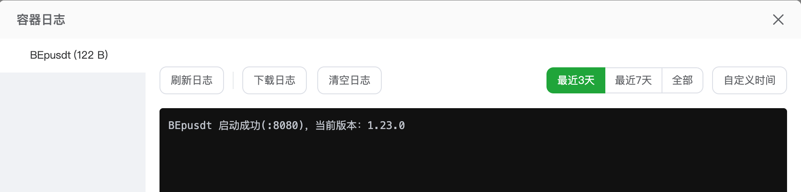

# 宝塔面板部署 BEpusdt 完整指南

本教程假设你已成功安装宝塔面板。请按照以下步骤进行部署。

## 部署步骤

### 步骤一：创建容器

首先确保已安装 Docker 模块。如未安装，请在宝塔面板中完成安装。

### 步骤二：配置容器参数

根据以下说明配置容器参数：

| 配置项      | 说明                                                         |
|----------|------------------------------------------------------------|
| **镜像**   | 正式版：`v03413/bepusdt:latest` / 开发版：`v03413/bepusdt:nightly` |
| **端口**   | 反向代理场景：按图配置；外网暴露：两个端口均填 `8080` 并勾选"对外暴露"                   |
| **重启规则** | 无特殊需求时按图中默认配置                                              |

配置完成后，点击右下角**创建**按钮，等待容器创建完成。

### 步骤三：验证容器启动

返回容器列表，找到新建的 BEpusdt 容器，依次点击**操作** → **更多** → **日志**查看启动日志。

**成功标志**：日志中出现如上所示内容表示启动成功。

若已对外暴露 8080 端口，访问 `http://<服务器IP>:8080` 可查看初始化页面。

## 配置反向代理

### 创建站点和反向代理

在宝塔面板中执行以下操作：

1. 添加站点（PHP 版本选择**纯静态**）
2. 为该站点配置反向代理，如下图所示：

### 验证配置

- 确保域名已正确解析
- 访问你的域名，能正常打开即表示反向代理配置成功
- **建议启用 HTTPS** 以提高安全性