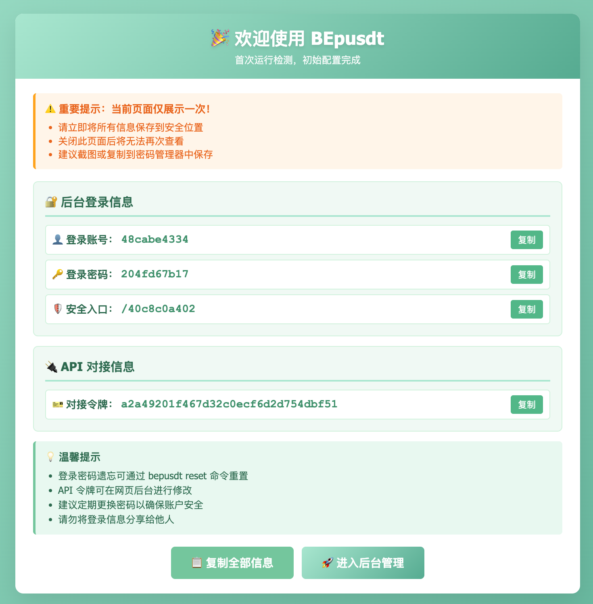

# Docker 部署

## 准备工作

1. **安装 Docker：** 确保服务器已经安装 Docker，这里不阐述安装细节。
2. **推荐服务器：** 推荐使用新加坡服务器(Debian12+)，性能无硬性要求，主要确保网络通畅；
   推荐尽量知名厂商(例如：Aws Gcp DigitalOcean 等)，一方面安全更有保障，其次一些私人VPS总是出现一些奇奇怪怪的问题！

## 部署命令

```bash
docker run -d --restart=unless-stopped -p 8080:8080 v03413/bepusdt:latest
```

### 参数说明：

- `-p 8080:8080` 表示将宿主机的 8080 端口映射到容器的 8080 端口，使得应用可以通过宿主机的端口访问。
- `--restart=unless-stopped` 确保你的容器在遇到问题时可以自动重启。
- 版本说明：`v03413/bepusdt:latest` 为最新发行版镜像，`v03413/bepusdt:nightly`为每日构建的滚动开发版。

## 部署验证

确保命令执行无误后，控制台会返回一个容器 ID，执行命令 `docker logs -f [容器ID]` 如果一切正常则能看到启动成功信息；
此时可以通过访问`http://[你的IP]:8080/[安全入口]`便可以看到安装完成，保存相关信息之后登录即可；如图：



## 忘记密码

执行命令重置：

```bash
docker exec -it [容器ID] bepusdt  reset
```

[‼️强烈推荐配置 TronGrid Api Key 提高 Tron 扫块稳定性](../tron-grid/readme.md)
---