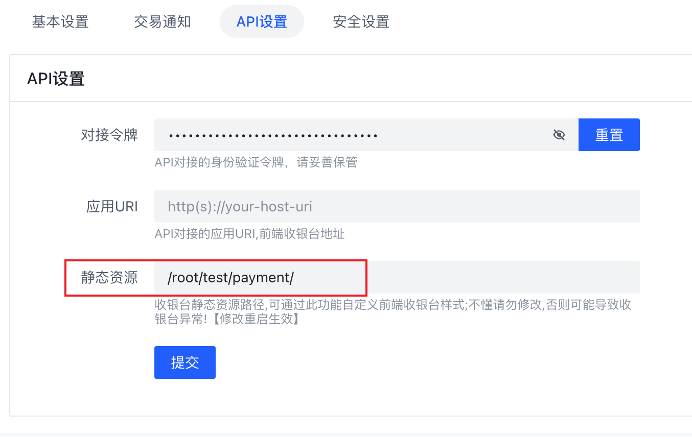
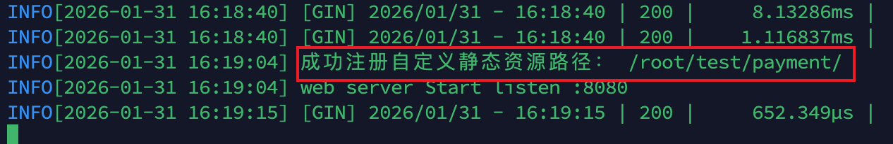

# 收银台自定义修改指南

## 概述

本文档介绍如何自定义修改 BEpusdt 收银台的网页模板。本指南假设您已具备基本的 Linux/Docker 和前端开发知识。

## 获取默认资源文件

收银台的网页资源文件位于官方仓库：

https://github.com/v03413/BEpusdt/tree/main/static/payment

## 目录结构

```bash
./payment
├── assets
│   ├── css          # 样式文件
│   ├── i18n         # 国际化配置
│   ├── img          # 图片资源
│   ├── js           # JavaScript 文件
│   └── locales      # 多语言文件
└── views
    ├── bsc.bnb.html
    ├── ethereum.eth.html
    ├── index.html
    ├── installed.html
    ├── tron.trx.html
    ├── usdc.aptos.html
    ├── usdc.arbitrum.html
    ├── usdc.base.html
    └── ...
```

**目录说明：**

- **assets** - 静态资源文件（CSS、JavaScript、图片、国际化文件）
- **views** - 各币种对应的收银台 HTML 模板文件，每个 HTML 文件对应一个币种的收银台页面

## 修改步骤

### 1. 修改网页模板

在 `views` 目录下编辑相应的 HTML 文件进行自定义修改。

### 2. 上传资源文件到服务器

#### Linux 直接部署

将修改后的整个 `payment` 目录上传到服务器指定路径：

```bash
# 示例：上传到 /root/test/payment/
scp -r ./payment user@server:/root/test/
```

#### Docker 部署

**选项 A：使用 Volume 挂载（推荐）**

在启动容器时挂载本地目录，避免每次都复制文件：

```bash
docker run -v /root/test/payment:/app/static/payment <image_id>
```

**选项 B：复制到运行中的容器**

```bash
docker cp payment/ <container_id>:/app/static/
```

### 3. 配置静态资源路径



1. 登录 BEpusdt 后台管理系统
2. 进入 **系统管理** → **基本设置** → **API 设置**
3. 在**静态资源路径**字段中填入完整目录路径
4. 点击保存

### 4. 重启服务并验证

重启 BEpusdt 服务：

```bash
# Linux 直接部署
systemctl restart bepusdt

# Docker 部署
docker restart <container_id>
```

查看服务日志，确认出现资源注册成功提示（如下图所示），则表示配置正确。之后访问当请求到对应的交易类型收银台时便能看到修改效果。


