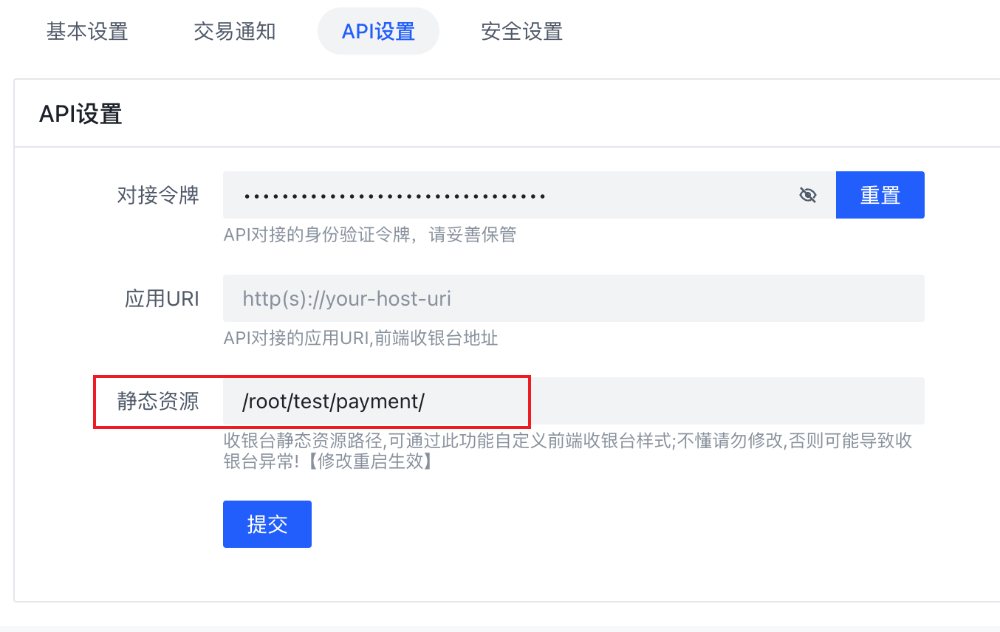
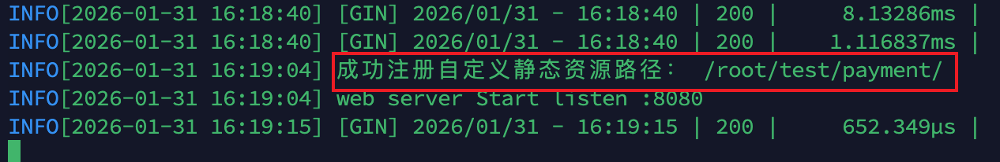

# 收银台模板配置与自定义指南

## 概述

本文档介绍 BEpusdt 收银台模板模式、内置 LangGe design 模板，以及如何自定义修改收银台网页模板。自定义模板部分假设您已具备基本的 Linux/Docker 和前端开发知识。

## 获取默认资源文件

收银台的网页资源文件位于官方仓库：

https://github.com/v03413/BEpusdt/tree/main/static/payment

## 模板模式

后台 **系统管理** → **基本设置** → **API 设置** 中的「收银台模板」支持三种模式：

| 配置值 | 后台展示 | 说明 |
| ------ | -------- | ---- |
| `official` | 官方默认 | 使用 BEpusdt 默认收银台模板和各币种直接付款模板 |
| `wolf` | 狼哥设计 | 使用内置 LangGe design 收银台模板，页面品牌仍为 BEpusdt |
| `custom` | 自定义模板 | 从「收银台静态资源」路径加载自定义模板和资源 |

`official` 和 `wolf` 都是内置模板。模板文件在程序启动时已经从内置资源中加载，保存后新打开的收银台页面会按当前配置选择模板，无需为了切换这两个内置模式而重启服务。

`custom` 模式会从磁盘路径加载模板和资源；新增、删除或修改该路径下的模板文件后，需要重启服务让 Gin 重新解析磁盘模板。历史配置兼容规则保持不变：如果旧版本只配置了 `payment_static_path` 且没有 `payment_template`，系统仍会按自定义模板处理。

## LangGe design

LangGe design 内置支持 `zh`、`zh-Hant`、`en`、`ru`、`vi`、`tr`、`ja`、`ko` 八种语言，并使用本地静态资源，不依赖外部 CDN。

选择 `wolf` 模式时，后台会显示「默认语言」设置。默认值 `auto` 表示跟随浏览器语言；如果商户设置为具体语言，新打开的 LangGe design 收银台会优先使用该语言。用户通过页面语言菜单手动切换后，浏览器本地选择优先于后台默认值；URL 参数 `?lang=` 仍拥有最高优先级。

默认语言支持以下配置值：

| 配置值 | 说明 |
| ------ | ---- |
| `auto` | 跟随浏览器语言 |
| `zh` | 简体中文 |
| `zh-Hant` | 繁體中文 |
| `en` | English |
| `ru` | Русский |
| `vi` | Tiếng Việt |
| `tr` | Türkçe |
| `ja` | 日本語 |
| `ko` | 한국어 |

> 开发提示：模板中通过 `<script>` 注入的结构化数据必须使用 HTML-safe JSON 序列化。Go 的 `json.Marshal` 默认会转义 `<`、`>`、`&` 等字符；不要关闭该行为，也不要用字符串拼接生成 `network` 或 `selected_payment` 这类 JSON 数据。

## 目录结构

```bash
./payment
├── assets
│   ├── css          # 样式文件
│   ├── i18n         # 国际化配置
│   ├── img          # 图片资源
│   ├── js           # JavaScript 文件
│   └── locales      # 多语言文件
└── views
    ├── bsc.bnb.html
    ├── ethereum.eth.html
    ├── index.html
    ├── installed.html
    ├── tron.trx.html
    ├── wolf.cashier.html
    ├── wolf.checkout.html
    ├── usdc.aptos.html
    ├── usdc.arbitrum.html
    ├── usdc.base.html
    └── ...
```

**目录说明：**

- **assets** - 静态资源文件（CSS、JavaScript、图片、国际化文件）
- **views** - 各币种对应的收银台 HTML 模板文件，每个 HTML 文件对应一个币种的收银台页面
- **views/wolf.cashier.html** - LangGe design 收银台选择页
- **views/wolf.checkout.html** - LangGe design 直接付款页

## 修改步骤

### 1. 修改网页模板

在 `views` 目录下编辑相应的 HTML 文件进行自定义修改。

### 2. 上传资源文件到服务器

#### Linux 直接部署

将修改后的整个 `payment` 目录上传到服务器指定路径：

```bash
# 示例：上传到 /root/test/payment/
scp -r ./payment user@server:/root/test/
```

#### Docker 部署

**选项 A：使用 Volume 挂载（推荐）**

在启动容器时挂载本地目录，避免每次都复制文件：

```bash
docker run -v /root/test/payment:/app/static/payment <image_id>
```

**选项 B：复制到运行中的容器**

```bash
docker cp payment/ <container_id>:/app/static/
```

### 3. 配置静态资源路径



1. 登录 BEpusdt 后台管理系统
2. 进入 **系统管理** → **基本设置** → **API 设置**
3. 将「收银台模板」切换为 **自定义模板**
4. 在**静态资源路径**字段中填入完整目录路径
5. 点击保存

### 4. 重启服务并验证

重启 BEpusdt 服务：

```bash
# Linux 直接部署
systemctl restart bepusdt

# Docker 部署
docker restart <container_id>
```

查看服务日志，确认出现资源注册成功提示（如下图所示），则表示配置正确。之后访问当请求到对应的交易类型收银台时便能看到修改效果。


