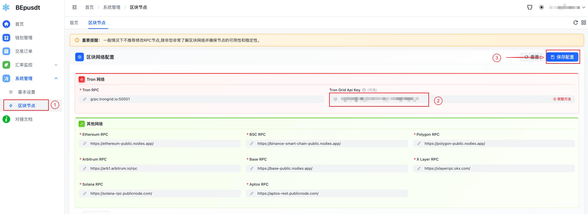

# TronGrid

> 系统默认内置 Tron 的公共RPC节点是：`grpc.trongrid.io:50051`，虽然目前无频率限制，但时间一长增加限制是必然趋势；
> 所以强烈建议配置 TronGrid Api Key 提高 Tron 扫块稳定性，避免因节点频率限制导致订单确认失败等问题，
> **而且基础服务计划足以满足个人需求，无需额外付费！**。

## 获取 Api Key

1. 访问 https://www.trongrid.io/register 使用邮箱注册账号并完成登录。
2. 登录后找到`API Keys`选项，点击`Create API Key`填写名称后提交即可。

## 配置 Api Key

你的`Api Key`应该是类似这个样子：`648870c0-xxxx-xxxx-xxxx-c7ac4ec263b0`  
拿到之后登录 BEpusdt 后台，进入`系统管理`->`区块节点`->`Tron 网置`，将 Api Key 填入`TronGrid Api Key`输入框，保存即可生效。

如图：

